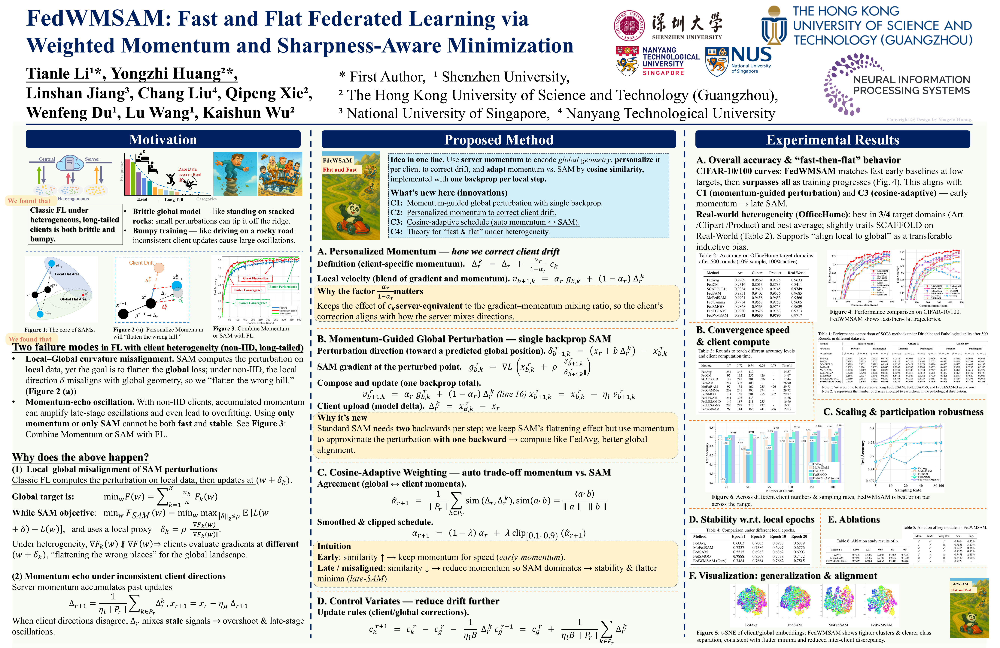

# FedWMSAM

**Fast & Flat Federated Learning via Weighted Momentum and Sharpness-Aware Minimization (NeurIPS 2025)**

<p align="center">
  
</p>

**FedWMSAM** is a federated optimization method designed for **heterogeneous (non-IID) and long-tailed** client data, delivering **fast convergence** and **flat solutions** at **FedAvg-like client cost** (one backprop per local step).

---

## ✨ Highlights

* **Purpose-built for non-IID & long-tailed data.** Tackles two failure modes in FL: **local–global misalignment** (SAM flattens the wrong region) and **momentum echo** (late-stage oscillation).
* **Single-backprop efficiency.** Keeps the compute close to FedAvg by using one backward pass per local step.
* **Three key mechanisms.**

  * **C1 — Momentum-guided global perturbation:** align local updates to the **global** landscape (one backprop).
  * **C2 — Personalized momentum:** **server-equivalent scaling** reduces local→global bias under non-IID.
  * **C3 — Adaptive training schedule:** automatically balances **momentum ↔ SAM** (fast early → flat later).
* **Theory support.** Perturbation-induced variance and a convergence bound explain when/why momentum should be damped under heterogeneity.

---

## 🔎 Poster Content (TL;DR)

### Motivation — Why classic FL struggles under heterogeneity

* **Heterogeneous & long-tailed clients** pull the model in conflicting directions; tail classes underfit.
* **Failure #1: Local–global misalignment.** SAM computes the perturbation from **local** curvature, but the goal is **global**, so clients evaluate gradients at different $(w+\delta_k)$ and may flatten the **wrong region**.
* **Failure #2: Momentum echo.** Server momentum mixes stale/biased directions; SAM-style perturbations **increase variance**, amplifying late oscillation.

### Method — FedWMSAM in one page

* **C1 · Momentum-guided global perturbation (single backprop).**
  Use server-aggregated momentum (personalized to client (k)) to predict where the **global** model is heading and **steer** the perturbation there:

$$
\delta^{(r)}_{b+1,k} = \left(x_r + b \cdot \Delta_r^{(k)}\right) - x^{(r)}_{b,k}, \quad
g^{(r)}_{b,k} = \nabla L\left(x^{(r)}_{b,k} + \rho \frac{\delta^{(r)}_{b+1,k}}{\|\delta^{(r)}_{b+1,k}\|}\right).
$$

  One gradient at the perturbed point → **FedAvg-like** client cost.
* **C2 · Personalized momentum (drift correction).**
  **Server-equivalent scaling** aligns client mixing with the server:

$$
\Delta_r^{(k)} = \Delta_r + \frac{\alpha_r}{1-\alpha_r} c_k, \qquad
v^{(r)}_{b+1,k} = \alpha_r g^{(r)}_{b,k} + (1-\alpha_r) \Delta_r^{(k)}.
$$

  Reduces **local→global bias**; stabilizes aggregation.
* **C3 · Adaptive training schedule (momentum ↔ SAM).**
  Read training signals (direction disagreement/noise) and **reduce momentum** when misaligned; **keep** it when aligned. Effect: **fast early, flat later**.
* **Theory at a glance.**
  Perturbations raise variance $\sigma_{\rho}^{2}=\sigma^{2}+(L\rho)^{2}$; the bound

$$
\frac{1}{R}\sum_{r=1}^{R} \mathbb{E}\|\nabla f(x_r)\|^{2}
\lesssim \frac{L\Delta \sigma_\rho^{2}}{S K R}
+ \frac{L\Delta}{R}\left(1+\frac{N^{2/3}}{S}\right)
$$

  makes **noise** and **heterogeneity** explicit → damp momentum late.

### Experimental Results — What to look for on the poster

1. **Overall (Table 1).** Best or second-best across **3 datasets × 12 non-IID settings**; gains grow as heterogeneity strengthens (Dirichlet β=0.1; pathological splits).
2. **Real-world heterogeneity (Table 2, OfficeHome).** Best in **3/4** domains and best on average.
3. **Convergence & client cost (Fig. 4 + Table 3).** **Fast-then-flat** curves; reach multiple targets in **fewer rounds**; **~15 s** client time (close to FedAvg), far below double-backprop SAM methods.
4. **Sensitivity & robustness (Table 4 + Fig. 6).** Stable as local epochs increase; robust across numbers of clients and sampling rates, especially under sparse participation.
5. **Ablations & ρ-study (Table 5–6).** C2 is the largest single contributor; C3 acts as data-driven damping; best near $\rho\approx 0.01$ with **graceful decay** as ρ increases.

---

## 🚀 Quick Start

```bash
# Clone
git clone https://github.com/Huang-Yongzhi/NeurlPS_FedWMSAM.git
cd NeurlPS_FedWMSAM

# Option A) Use Python venv  
python3 -m venv .venv
source .venv/bin/activate
python -m pip install --upgrade pip
# CPU-only 
pip install torch torchvision --index-url https://download.pytorch.org/whl/cpu
pip install -r requirements.txt

# Option B) Use Conda + GPU (auto-install PyTorch based on CUDA)
conda create -n fedwmsam python=3.8 -y
conda activate fedwmsam
bash install.sh
```

### Train examples (ResNet-18 on CIFAR-10)

```bash
# View parameters 
python train.py --help

# IID
python train.py --iid

# Non-IID — Dirichlet β=0.1 (default is non-IID)
python train.py --split-rule Dirichlet --split-coef 0.1

# Non-IID — Pathological split with γ=2 classes per client
python train.py --split-rule Pathological --split-coef 2
```

> The code is built upon **FL-Simulator**, so most of its flags/configs also apply (e.g., number of clients, participation rate, epochs, learning rates, and model backbones).

---

## 📂 Repository Structure (minimal)

```
NeurlPS_FedWMSAM/
├─ client/              # client-side training and local updates
├─ server/              # server-side aggregation and scheduling
├─ optimizer/           # FedWMSAM optimizer and adapters
├─ command/             # run scripts and command wrappers
├─ poster/              # poster and related assets
├─ dataset.py           # dataset loading and splitting
├─ models.py            # model definitions
├─ utils.py             # utility functions
├─ train.py             # entry point
├─ run.sh               # example training script
├─ install.sh           # dependency installation
└─ NEURIPS25_FedWSAM_poster.PNG  # poster preview
```

---

## 🧠 How FedWMSAM differs (one slide version)

* **Align**: perturb toward **predicted global** using server momentum (C1).
* **Personalize**: server-equivalent scaling shrinks local→global bias (C2).
* **Adapt**: auto balance **momentum ↔ SAM** over time (C3).
* **Compute**: **one backprop** per local step (near-FedAvg cost).
* **Outcome**: **fast-then-flat** trajectories + robustness across non-IID settings.

---

## 📜 Citation

If you find this work useful, please cite:

```bibtex
@inproceedings{li2025fedwmsam,
  title     = {FedWMSAM: Fast and Flat Federated Learning via Weighted Momentum and Sharpness-Aware Minimization},
  author={Li, Tianle and Huang, Yongzhi and Jiang, Linshan and Liu, Chang and Xie, Qipeng and Du, Wenfeng and Wang, Lu and Wu, Kaishun},
  booktitle = {Advances in Neural Information Processing Systems (NeurIPS)},
  year      = {2025}
}
```

---
